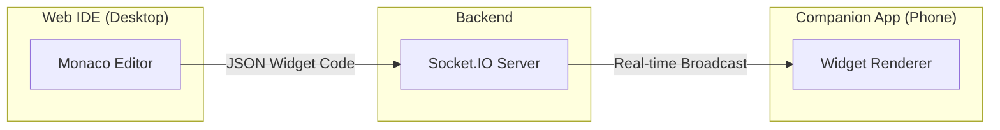

# ⚡ Companion Mode

A real-time code preview system connecting a web IDE to a mobile companion app via WebSocket. The "Killer Feature" for mobile dev ed-tech platforms.

> Student writes `Text("Hello")` on their laptop, looks down at their phone, and sees it immediately. ✨

## 🎯 What Is This?



## ✨ Features

- 🔗 **Easy Pairing** - 6-character code to connect devices
- ⚡ **Real-time Preview** - See changes in ~300ms
- 🎨 **Dynamic Widget Rendering** - Render Flutter widgets from JSON
- 🔄 **Auto-reconnect** - Connection recovery on disconnect

---

## 📁 Project Structure

```
vibecoding/
├── server/                     # Node.js WebSocket Server
│   ├── package.json
│   └── src/
│       ├── index.js            # Express + Socket.IO server
│       └── sessionManager.js   # Pairing code management
│
├── web-ide/                    # Browser-based IDE
│   ├── index.html              # Main page
│   ├── css/styles.css          # Premium dark theme
│   └── js/app.js               # Monaco + Socket.IO client
│
└── companion_app/              # Flutter Mobile App
    ├── pubspec.yaml
    └── lib/
        ├── main.dart
        ├── screens/
        │   ├── pairing_screen.dart
        │   └── preview_screen.dart
        └── services/
            ├── socket_service.dart
            └── widget_renderer.dart
```

---

## 🚀 Quick Start

### Prerequisites

- **Node.js** 18+ with npm
- **Flutter SDK** 3.0+
- Android Emulator or physical device

---

### Step 1: Start the Backend Server

```bash
cd server
npm install
npm start
```

You should see:
```
╔═══════════════════════════════════════════════════════════╗
║           🚀 Companion Mode Server Started 🚀             ║
╠═══════════════════════════════════════════════════════════╣
║  HTTP Server:  http://localhost:3001                      ║
║  WebSocket:    ws://localhost:3001                        ║
╚═══════════════════════════════════════════════════════════╝
```

---

### Step 2: Open the Web IDE

**Option A:** Use a local server (recommended)
```bash
cd web-ide
npx serve .
```
Then open http://localhost:3000

**Option B:** Use VS Code Live Server extension
- Open `web-ide/index.html` in VS Code
- Right-click → "Open with Live Server"

---

### Step 3: Run the Flutter Companion App

```bash
cd companion_app
flutter pub get
flutter run
```

> **📱 Emulator Connection Notes:**
> - Android Emulator uses `10.0.2.2` to reach host's `localhost` (pre-configured)
> - iOS Simulator uses `localhost` directly
> - Physical device: use your computer's IP address

---

## 🔗 Testing the Connection

1. **Web IDE** displays a 6-character pairing code (e.g., `ABC123`)
2. **Enter the code** in the Companion App on your phone/emulator
3. **Type JSON** in the editor → See it render instantly on the device!

---

## 📋 Supported Widgets

| Widget | JSON Properties |
|--------|-----------------|
| `Text` | `data`, `style` (fontSize, fontWeight, color, fontStyle) |
| `Container` | `width`, `height`, `padding`, `margin`, `decoration`, `child` |
| `Center` | `child` |
| `Column` | `mainAxisAlignment`, `crossAxisAlignment`, `children` |
| `Row` | `mainAxisAlignment`, `crossAxisAlignment`, `children` |
| `SizedBox` | `width`, `height`, `child` |
| `Card` | `color`, `elevation`, `child` |
| `Padding` | `padding`, `child` |
| `Icon` | `icon`, `size`, `color` |

---

## 📝 Example Widget JSON

### Simple Text
```json
{
  "type": "Text",
  "data": "Hello, World!",
  "style": {
    "fontSize": 24,
    "fontWeight": "bold",
    "color": "#6366F1"
  }
}
```

### Column Layout
```json
{
  "type": "Center",
  "child": {
    "type": "Column",
    "mainAxisAlignment": "center",
    "children": [
      {
        "type": "Text",
        "data": "🚀 Hello, World!",
        "style": {
          "fontSize": 28,
          "fontWeight": "bold",
          "color": "#6366F1"
        }
      },
      {
        "type": "SizedBox",
        "height": 16
      },
      {
        "type": "Text",
        "data": "Typed on desktop, rendered on mobile",
        "style": {
          "fontSize": 14,
          "color": "#94A3B8"
        }
      }
    ]
  }
}
```

---

## 🔧 Configuration

### Changing Server URL (Companion App)

Edit `companion_app/lib/services/socket_service.dart`:

```dart
String _serverUrl = 'http://YOUR_SERVER_IP:3001';
```

| Platform | Server URL |
|----------|------------|
| Android Emulator | `http://10.0.2.2:3001` (default) |
| iOS Simulator | `http://localhost:3001` |
| Physical Device | `http://<YOUR_PC_IP>:3001` |

> **Tip:** For physical devices, ensure your computer and phone are on the same WiFi network.

---

## 🔄 How It Works

```
┌─────────────┐    ┌──────────────┐    ┌────────────────┐
│   Web IDE   │───▶│ WebSocket    │───▶│ Companion App  │
│  (Desktop)  │    │   Server     │    │    (Mobile)    │
└─────────────┘    └──────────────┘    └────────────────┘
     │                   │                     │
     │ 1. Create Session │                     │
     │──────────────────▶│                     │
     │                   │                     │
     │   Code: ABC123    │                     │
     │◀──────────────────│                     │
     │                   │                     │
     │                   │ 2. Join Session     │
     │                   │◀────────────────────│
     │                   │                     │
     │ 3. Type Code      │                     │
     │──────────────────▶│                     │
     │                   │                     │
     │                   │ 4. Broadcast Code   │
     │                   │────────────────────▶│
     │                   │                     │
     │                   │                     │ 5. Render Widget
```

---

## 🐛 Troubleshooting

| Problem | Solution |
|---------|----------|
| Can't connect to server | Ensure server is running at `localhost:3001` |
| Widget not rendering | Check JSON format is valid |
| Connection lost | Press "Reconnect" button in app |
| Emulator can't reach server | Use `10.0.2.2` instead of `localhost` |

---

## 📦 Tech Stack

| Component | Technology |
|-----------|------------|
| Backend | Node.js, Express, Socket.IO |
| Web IDE | HTML, CSS, Monaco Editor, Socket.IO Client |
| Mobile App | Flutter, Provider, socket_io_client |

---

## 🚧 Future Enhancements

- [ ] QR code scanning for easier pairing
- [ ] More widgets: `ListView`, `GridView`, `Image`
- [ ] Flutter-like DSL instead of raw JSON
- [ ] User authentication and persistent sessions
- [ ] Collaborative editing support

---

## 📄 License

Developed for edu-tech platform needs.

---

**Companion Mode** - Live preview feature for mobile development learning platforms ⚡
